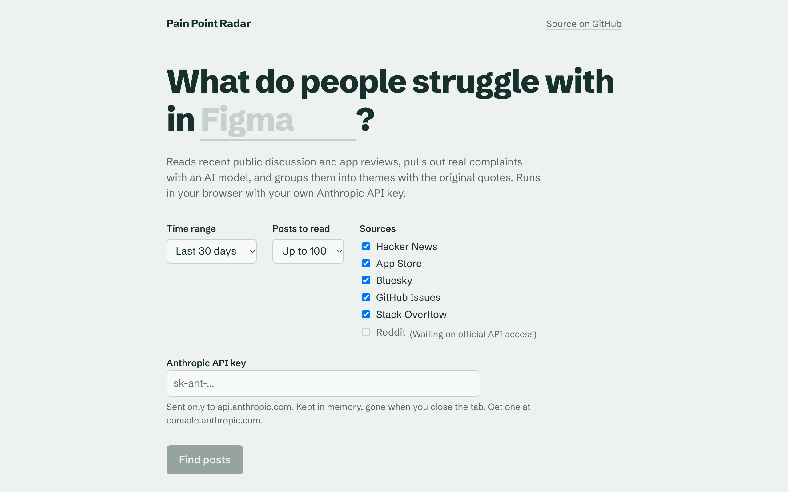
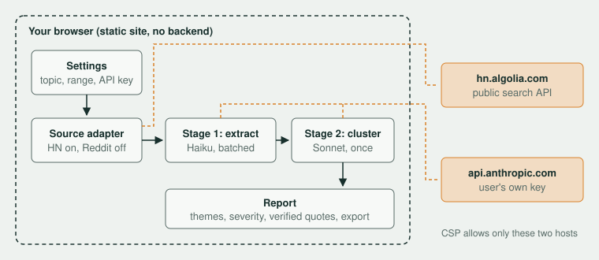

# Pain Point Radar

Type a product or topic, and Pain Point Radar reads recent public discussion and app reviews about it, pulls out real user complaints with Claude, and groups them into ranked themes backed by verbatim, linked quotes.

It runs entirely in the browser. There is no backend: you bring your own Anthropic API key, and it never leaves your tab except to call the Anthropic API.

**Live demo:** [pain-point-radar-delta.vercel.app](https://pain-point-radar-delta.vercel.app/)



## How it works



1. **Collect.** Each selected source adapter searches for the topic in the chosen time range and normalizes every post, issue and review into one `Item` shape. The sources are searched in parallel and interleaved up to the post limit (50 to 500), so one busy source cannot crowd out the others, and a source that fails is skipped with a note instead of failing the run.
2. **Extract.** Items go to Claude Haiku 4.5 in batches of 15, three batches at a time. For each item the model returns the pain points it describes, each with a verbatim quote.
3. **Verify.** Every quote is checked against the original text. A quote that does not appear in its source item is dropped, so the report cannot show a quote the model made up.
4. **Cluster.** All verified pain points go to Claude Sonnet 5.5 in a single call, which groups them into 3 to 8 themes and rates severity from 1 to 5.
5. **Report.** Mention counts and quotes are computed in code from the real data, not taken from the model. Themes are ranked by severity times mentions and can be exported as Markdown, JSON or PDF (through the browser's print dialog, so no PDF library is bundled).

Before any money is spent, the app shows how many posts it found from each source and an estimated cost, and waits for you to confirm.

## Design decisions

**No backend.** A server would mean holding other people's API keys. Keeping everything in the browser removes that risk entirely and makes the app free to host as a static site.

**Sources, and why not Reddit.** Every source has to be readable straight from a browser: free, no key, and served with CORS headers. Five pass that test today:

| Source | What it adds | Limit worth knowing |
| --- | --- | --- |
| Hacker News (Algolia) | Developer and founder discussion, ranked by relevance | Common words match other senses ("the notion of"), which the extraction prompt filters out |
| App Store reviews | End-user complaints with a star rating | Only products with an iPhone app whose name contains the topic; Apple serves the latest 500 reviews |
| Bluesky | Public social posts, closest to Twitter or Reddit | One page of 100 posts without signing in |
| GitHub Issues | Bugs and feature requests on developer tools | 10 searches a minute without a token, so 3 pages per run |
| Stack Overflow | Developers stuck on a tool or API | Traffic has dropped sharply, so recent results are sparse |

The original version of this tool read Reddit. In late 2025 Reddit closed self-serve API access for new developers, and in 2026 it shut the unauthenticated JSON endpoints (they now answer 403). Instead of scraping around that, the Reddit adapter is registered but disabled until official API access is approved. Adding a source means writing one `SourceAdapter` file and adding its host to the CSP.

**Two models.** Extraction runs many times on small inputs, so it uses the fast, cheap model. Clustering runs once and needs judgment across everything, so it gets the stronger one.

**The model decides wording, code decides facts.** The LLM chooses theme names, summaries and severity. Counts, quotes and links come from the source data, and every LLM response is validated with zod (with one automatic retry) before it is used.

## Security

The full threat model is in [SECURITY.md](SECURITY.md). In short: the API key lives in memory only, a production Content-Security-Policy allows network calls only to the Anthropic API and the five source APIs, external text is always rendered as plain text, only `https` links are rendered, and post content is passed to the model inside `<untrusted>` tags with instructions to treat it as data.

## Run it locally

You need Node.js 20 or newer.

```bash
git clone https://github.com/GiliGerson/pain-point-radar.git
cd pain-point-radar
npm install
npm run dev
```

Open the printed local address, type a topic, paste an Anthropic API key from [console.anthropic.com](https://console.anthropic.com), and run.

```bash
npm test          # unit tests with recorded fixtures, no network
npm run build     # type check and production build into dist/
```

## Sample report

If `public/demo-report.json` exists, the app shows it on first visit, so people can see a result without a key. To create one, run the app on a topic, click **Download JSON**, and save the file as `public/demo-report.json`.

## Project structure

```
src/
  sources/     SourceAdapter interface, one adapter per source, parallel search
  llm/         Anthropic browser client and a mock used in tests
  pipeline/    prompts, extraction, quote verification, clustering, cost estimate
  components/  report view and the severity glyph
  __tests__/   tests and recorded API fixtures
```

## Roadmap

- Evals: a hand-labelled set of 20 to 30 items to measure extraction quality in CI
- Watch mode: re-run on a schedule and highlight only new complaints
- Reddit adapter on the official API, once access is approved
- Google Play reviews (needs a small proxy, since Google serves no CORS API)

## License

MIT
